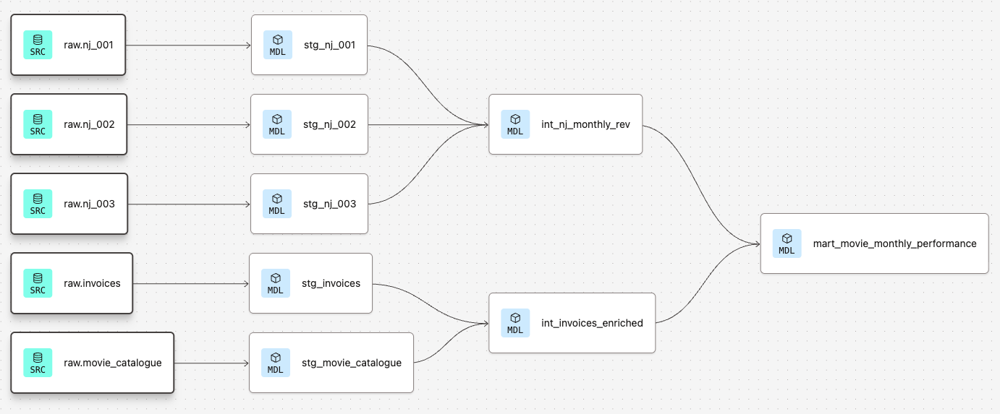

# Silver Screen Analytics

### A dbt Cloud Project for Movie Revenue Transformation and Analysis

---

## 1️⃣ Project Overview

The **Silver Screen Analytics** project transforms raw movie rental and revenue data from several CSV files into a **clean, tested, and analytics-ready dataset** in **Snowflake**, orchestrated through **dbt Cloud**.

The main objective was to:

- Clean and standardize raw input data from different theater locations
- Integrate and enrich the datasets into a unified analytical structure
- Provide a final data mart showing **monthly movie performance by location**

All models, tests, and documentation are fully managed in **dbt Cloud**.

---
## Data Sources

The project uses five raw data sources provided as CSV files and loaded into Snowflake.  
These represent different operational aspects of the Silver Screen cinema chain:  

- **`movie_catalogue`** — metadata for all movies, including title, genre, studio, and release details.  
- **`invoices`** — monthly rental invoices issued for each movie and theater location.  
- **`nj_001`**, **`nj_002`**, and **`nj_003`** — ticket sales and transaction data from three separate theater locations, each with different formats and levels of aggregation.  

All sources were defined in dbt via the `sources.yml` file to ensure transparent lineage and maintain consistent referencing across models.  
This setup enables clear traceability from raw inputs in Snowflake to the final analytical outputs.

---

## 2️⃣ Data Architecture

The project follows a **three-layered architecture**, ensuring clear separation between data stages:

| Layer | Description | Example Models |
| --- | --- | --- |
| **Staging (`stg_`)** | Cleans and standardizes the raw Snowflake source data | `stg_movie_catalogue`, `stg_invoices`, `stg_nj_001`, `stg_nj_002`, `stg_nj_003` |
| **Intermediate (`int_`)** | Combines, aggregates, and enriches staging data | `int_nj_monthly_rev`, `int_invoices_enriched` |
| **Mart (`mart_`)** | Delivers final analytical dataset for BI tools | `mart_movie_monthly_performance` |

---
## Data Lineage Overview

The dbt lineage graph below illustrates the full transformation flow —
from raw sources to staging, intermediate, and finally the mart layer:



---

## 3️⃣ Key Transformations

### Staging Models

- **nj_-Tables Consolidation**
    
    Three different theater sources (`nj_001`, `nj_002`, `nj_003`) were standardized to a **common structure** (same column names and data types) to enable a smooth **UNION ALL** in the intermediate layer.
    
    Each table was transformed into a monthly aggregated format using:
    
    ```sql
    date_trunc('month', timestamp or date) as month
    
    ```
    
    to ensure consistency across sources.
    
- **stg_invoices**
    
    The column `total_invoice_sum` contained **synthetic anomalies** in the dataset (e.g., duplicate values for the same movie/month/location).
    
    Therefore, `MIN(total_invoice_sum)` was deliberately chosen instead of `SUM()` to ensure consistent pricing per movie and month:
    
    ```sql
    min(total_invoice_sum) as total_price
    
    ```
    
- **stg_movie_catalogue**
    
    Missing genres were filled with `'Unknown'`.
    

---

### Intermediate Models

- **int_nj_monthly_rev**
    
    Combined the three standardized NJ tables via `UNION ALL` to form one comprehensive dataset of monthly theater revenues and ticket counts.
    
- **int_invoices_enriched**
    
    This model enriches invoice data with detailed movie information by joining the cleaned invoice table (`stg_invoices`) with the movie catalogue (`stg_movie_catalogue`):
    
    ```sql
    select
        cat.movie_id,
        cat.movie_title,
        cat.genre,
        inv.month,
        lower(inv.location_id) as location_id,
        inv.studio,
        inv.total_price
    from {{ ref("stg_invoices") }} as inv
    left join {{ ref("stg_movie_catalogue") }} as cat
        on cat.movie_id = inv.movie_id
    
    ```
    
    **Rationale for the LEFT JOIN**
    
    A **LEFT JOIN** is used to ensure that all invoice records are retained — even if some movie IDs do not exist in the catalogue table.
    
    This decision reflects a data-quality-conscious approach: missing catalogue entries shouldn’t cause loss of financial data, since invoices represent authoritative business transactions.
    
    Movie metadata (title, genre) will appear as `NULL` for such cases, which can later be handled or flagged in reporting.
    

---

### Mart Model

- **mart_movie_monthly_performance**
    
    Final model merging:
    
    - `int_nj_monthly_rev` (aggregated performance data)
    - `int_invoices_enriched` (rental cost & movie metadata)
    
    Key calculated field:
    
    ```sql
    round((rev.total_revenue - inv.total_price) / nullif(rev.total_revenue, 0), 2) as gross_margin
    
    ```
    
    → This **gross margin** metric was added as an **additional analytical enhancement** beyond the original task.
    

---

## 4️⃣ Testing & Quality Assurance

To ensure data reliability, both **generic** and **custom test** were implemented:

| Test Type | Description | Location |
| --- | --- | --- |
| **Generic Tests** | `not_null`, `unique` tests for key columns like `movie_id` | YAML definitions |
| **Custom Data Tests** | Validate numeric and business logic rules | `/tests` directory |

**Custom SQL tests:**

- `test_total_price_positive.sql`
    
    Ensures no rental costs are negative:
    
    ```sql
    select * from {{ ref('mart_movie_monthly_performance') }}
    where rental_cost < 0
    
    ```
    
All tests successfully pass during `dbt build` in the development environment and are automated in the **production job**.

---

## 5️⃣ Documentation

All dbt objects are **fully documented** via YAML files:

| YAML File | Purpose |
| --- | --- |
| `dbt_project.yml` | Global dbt configuration and project metadata |
| `sources.yml` | Definition of Snowflake sources and their structure |
| `_stg_models.yml` | Documentation of staging models and columns |
| `_int_models.yml` | Documentation of intermediate logic and joins |
| `_mart_model.yml` | Detailed mart-level descriptions and field explanations |

Each column includes `description` fields and references where applicable, enabling automatic dbt documentation generation.

---

## 6️⃣ Automation & Deployment

A **dbt Cloud job** named **`SilverScreen - Production Build`** was created in the **production environment (`dbt_production`)**.

- Executes full pipeline with `dbt build`
- Runs all tests and model builds automatically
- Uses a dedicated **deployment schema**
- Logs are stored and can be reviewed in dbt Cloud

This ensures a consistent, error-free data refresh and continuous data quality checks.

---

## 7️⃣ Final Outcome

✅ **Clean and unified data pipeline** integrating all Silver Screen theaters

✅ **Fully documented** and **tested** transformations

✅ **Automated production job** ensuring reliability

✅ **Analytical-ready dataset** including gross margin metric for profitability analysis

---

## 8️⃣ Next Steps

- Connect the `mart_movie_monthly_performance` model to BI tools such as **Tableau** or **Power BI**.
- Create trend and profitability visualizations by **month**, **studio**, and **location**.
- Explore additional KPIs such as ticket price averages or genre-level performance.

---

**Author:** Roberto Pera

**Environment:** dbt Cloud + Snowflake

**Date:** October 2025
